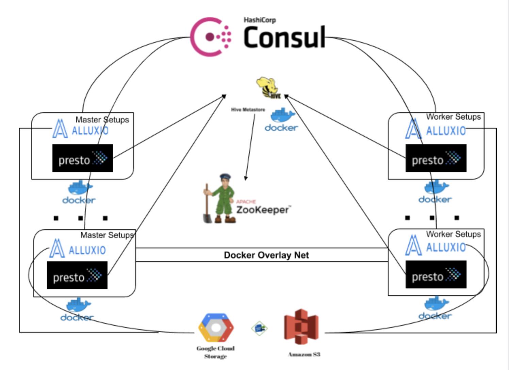

# wormhole

This project contains Docker files for Alluxio and Presto setups, using Hive metastore. 



## Note: This tutorial is for Ubuntu 18.04 LTS VMs

#### Install Java8 and Python on all VMs
```
1. apt install openjdk-8-jre-headless
2. apt-get install python
```

#### Add datamaster/{user} private file in .ssh/id_rsa in all VMs(create a common user in all VMs)
```
Copy content of utils/id_rsa to .ssh/id_rsa for datamaster user in all machines. 
If you are using some other user, make sure its private key is in same location in all machines.
```

#### Setup [docker](Docker.md) on each VM

#### Setup [alluxio-master](alluxio-master/README.md)

#### Setup [alluxio-worker](alluxio-worker/README.md)

#### Setup [hive](hive/README.md)

#### Setup [presto-coordinator](presto-coordinator/README.md)

#### Setup [presto-worker](presto-worker/README.md)
